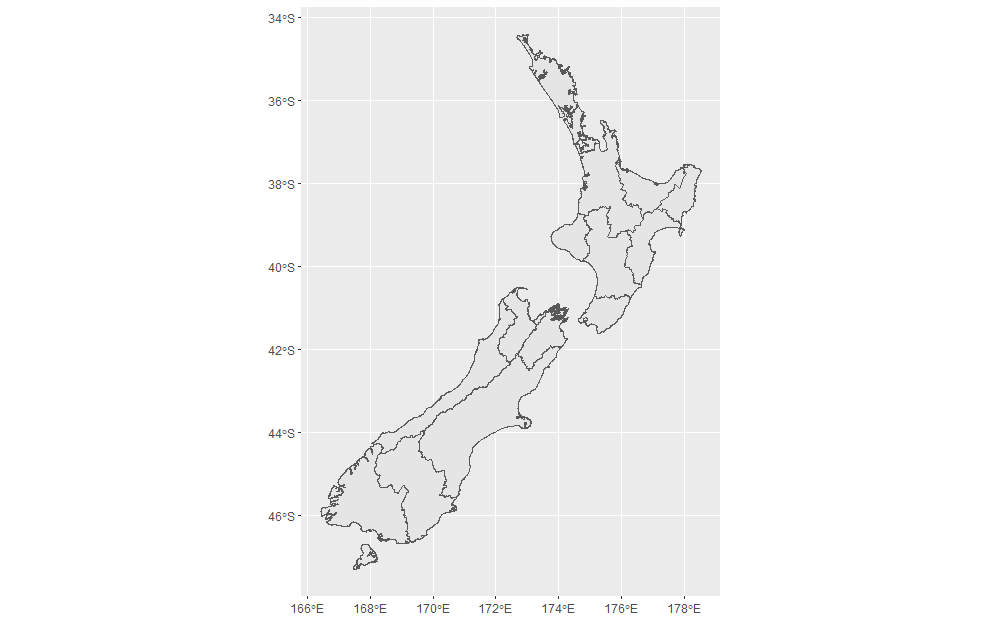

<!-- README.md is generated from README.Rmd. Please edit that file -->

# compmap

<!-- badges: start -->
<!-- badges: end -->

The goal of compmap is to download maps of countries from the
[gadm](https://gadm.org) package database (using the `raster` package)
and then use `rmapshaper` functions to compress the file size as
desired.

## Installation

``` r
devtools::install_github("flee598/compmap")
```

## Example

Download a map of New Zealand and reduce the file size (this reduces the
original map from \~24 Mb to \~500 kb).

``` r
library(compmap)
library(ggplot2)

nz <- fun_get_map(cntry = "NZ", kp = 0.03, min_area = 0.001)

# plot the resulting map
ggplot(nz) +
  geom_sf()
```


